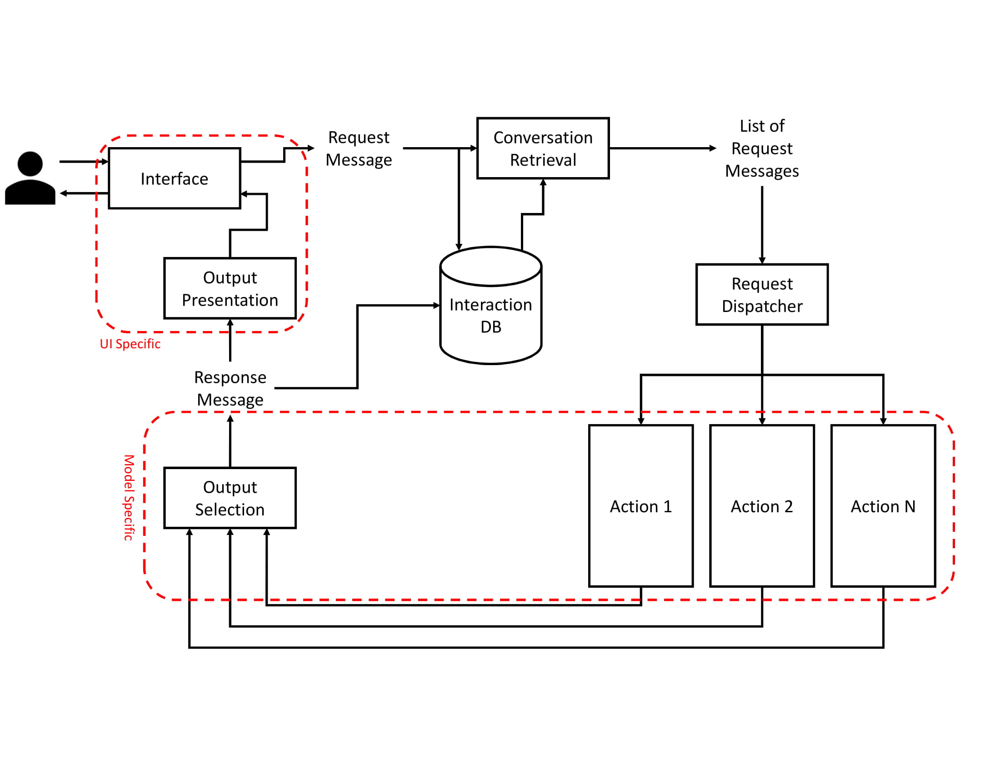

# Macaw: An Extensible Conversational Information Seeking Platform
Conversational information seeking (CIS) has been recognized as a major emerging research area in information retrieval.
Such research will require data and tools, to allow the implementation and study of conversational systems. Macaw is
an open-source framework with a modular architecture for CIS research. Macaw supports *multi-turn*, *multi-modal*, and 
*mixed-initiative* interactions, for tasks such as document retrieval, question answering, recommendation, and 
structured data exploration. It has a modular design to encourage the study of new CIS algorithms, which can be 
evaluated in batch mode. It can also integrate with a user interface, which allows user studies and data collection in 
an interactive mode, where the back end can be *fully algorithmic* or a *wizard of oz* setup. 

Macaw could be of interest to the researchers and practitioners working on information retrieval, natural language 
processing, and dialogue systems.

For more information on Macaw, please refer to [this paper](https://arxiv.org/pdf/1912.08904.pdf).

Table of content:
+ [Macaw Architecture](#macaw-architecture)
    + [Interfaces](#interfaces)
    + [Retrieval](#retrieval)
    + [Answer Selection and Generation](#answer-selection-and-generation)
+ [Installation](#installation) 
+ [Running Macaw](#running-macaw)
+ [Bug Report and Feature Request](#bug-report-and-feature-request)
+ [Citation](#citation)
+ [License](#license)
+ [Contribution](#contribution)

## Macaw Architecture
Macaw has a modular architecture, which allows further development and extension. The high-level architecture of Macaw
is presented below:



For more information on each module in Macaw, refer to this paper.

#### Interfaces
Macaw supports the following interfaces:
+ Standard IO: For *development* purposes
+ File IO: For *batch experiments* (see the examples in the `data` folder for input and output file formats)
+ Telegram bot: For interaction with real users

Here is an example of the Telegram interface for Macaw. It supports multi-modal interactions (text, speech, click, etc).

 


#### Retrieval
Macaw features the following search engines:
+ [Indri](http://lemurproject.org/indri.php): an open-source search engine that can be used for any arbitrary text 
collection. 
+ Bing web search API: sending a request to the Bing API and getting the results.

#### Answer Selection and Generation
For question answering, Macaw only features [the DrQA model](https://github.com/facebookresearch/DrQA) in its current 
version.


## Installation
Macaw requires `Python >= 3.6` and `pip3`. If you don't have `setuptools`, run `sudo pip3 install setuptools`. 
To install Macaw, first **clone macaw** from this repo and then follow the following installation steps. The
mentioned installation commands can be executed on Ubuntu. You can use the same or similar commands on other Linux 
distribution. If you are using Windows 10, we recommend installing Macaw and all the required packages on 
[Windows Subsystem for Linux](https://docs.microsoft.com/en-us/windows/wsl/install-win10).

#### Step 1: Installing MongoDB server
Macaw uses MongoDB for storing and retrieving user interactions (conversations). To install MongoDB server, run the
following command:
```
sudo apt-get install mongodb-server-core
```

#### Step 2: Installing Indri and Pyndri
[Indri](http://lemurproject.org/indri.php) is an open-source search engine for information retrieval research, 
implemented as part of the [Lemur Project](http://lemurproject.org/).
[Pyndri](https://github.com/cvangysel/pyndri) is a python interface to Indri. Macaw uses Indri for retrieving documents 
from an arbitrary text collection.
To install Indri, first download Indri from https://sourceforge.net/projects/lemur/files/lemur/. As suggested by pyndri,
we have used Indri-5.11. This Indri version can be installed as follows:
```
# download indri-5.11.tar.gz
sudo apt install g++ zlib1g-dev
tar xzvf indri-5.11.tar.gz
rm indri-5.11.tar.gz
cd indri-5.11
./configure CXX="g++ -D_GLIBCXX_USE_CXX11_ABI=0"
make
sudo make install
```

Then, clone the pyndri repository from https://github.com/cvangysel/pyndri and run the following command:
```
python3 setup.py install
```

At this step, you can make sure your installation is complete by running the pyndri tests.

#### Step 3: Installing Stanford Core NLP
Stanford Core NLP can be used for tokenization and most importantly for co-reference resolution. If you do not need 
co-reference resolution, you can ignore this step. Stanford Core NLP requires `java`. Get it by following these 
commands:
```
wget -O "stanford-corenlp-full-2017-06-09.zip" "http://nlp.stanford.edu/software/stanford-corenlp-full-2017-06-09.zip"
sudo apt-get install unzip
unzip "stanford-corenlp-full-2017-06-09.zip"
rm "stanford-corenlp-full-2017-06-09.zip"
``` 

If you don't have `java`, install it using:
```
sudo apt-get install default-jre
```

#### Step 4: Installing DrQA
Macaw also supports answer extraction / generation for user queries from retrieved documents. For this purpose, it 
features [DrQA](https://github.com/facebookresearch/DrQA). If you do not need this functionality, ignore this step (you
can also install this later). 
To install DrQA, run the following commands:
```
git clone https://github.com/facebookresearch/DrQA.git
cd DrQA
pip3 install -r requirements.txt
pip3 install torch
sudo python3 setup.py develop
```

To use pre-trained DrQA model, use the following command. 
```
./download.sh
```
This downloads a 7.5GB (compressed) file and requires 25GB (uncompressed) space. This may take a while!
 


#### Step 5: Installing FFmpeg
To support speech interactions with users, Macaw requires FFmpeg for some multimedia processing steps. If you don't 
need a speech support from Macaw, you can skip this step. To install FFmpeg, run the following command:
```
sudo apt-get install 
```

#### Step 6: Installing Macaw
After cloning Macaw, use the following commands for installation:
```
cd macaw
sudo pip3 install -r requirements.txt
sudo python3 setup.py install
```

## Running Macaw
If you run macaw with interactive (or live) mode, you should first run MongoDB server using the following command:
```
sudo mongod
```
Note that this command uses the default database directory (`/data/db`) for storing the data. You may need to create 
this directory if you haven't. You can also use other locations using the `--dbpath` argument. 


We provide three different main scripts (i.e., app):
+ `live_main.py`: An interactive conversational search and question answering system. It can use both STDIO and Telegram
interfaces.
+ `batch_ext_main.py`: A model for running experiments on a reusable dataset. This main script uses FILEIO as the 
interface.
+ `wizard_of_oz_main.py`: A main script for Wizard of Oz experiments.
 
After selecting the desired main script, open the python file and provide the required parameters. For example, you need
to use your Bing subscription key (if using Bing), the path to Indri index (if using Indri), Telegram bot token (if 
using Telegram interface), etc. in order to run the `live_main.py` script. You can further run the favorite main script
as below:

```
python3 live_main.py
```


## Bug Report and Feature Request
For bug report and feature request, you can open an issue in github, or send an email to 
[Hamed Zamani](http://hamedz.ir) at `hazamani@microsoft.com`.

## Citation
If you found Macaw useful, you can cite the following article:
```
Hamed Zamani and Nick Craswell, "Macaw: An Extensible Conversational Information Seeking System", arxiv pre-print.
```

bibtex:
```
@article{macaw,
  title={Macaw: An Extensible Conversational Information Seeking Platform},
  author={Zamani, Hamed and Craswell, Nick},
  journal={arXiv preprint arXiv:1912.08904},
  year={2019},
}
```

## License
Macaw is distributed under the **MIT License**. See the `LICENSE` file for more information.


## Contribution

This project welcomes contributions and suggestions.  Most contributions require you to agree to a
Contributor License Agreement (CLA) declaring that you have the right to, and actually do, grant us
the rights to use your contribution. For details, visit https://cla.opensource.microsoft.com.

When you submit a pull request, a CLA bot will automatically determine whether you need to provide
a CLA and decorate the PR appropriately (e.g., status check, comment). Simply follow the instructions
provided by the bot. You will only need to do this once across all repos using our CLA.

This project has adopted the [Microsoft Open Source Code of Conduct](https://opensource.microsoft.com/codeofconduct/).
For more information see the [Code of Conduct FAQ](https://opensource.microsoft.com/codeofconduct/faq/) or
contact [opencode@microsoft.com](mailto:opencode@microsoft.com) with any additional questions or comments.
